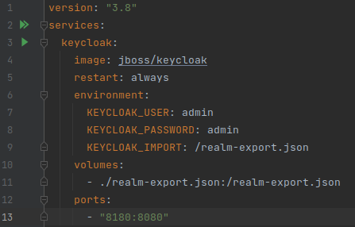
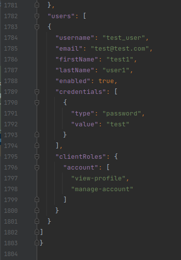
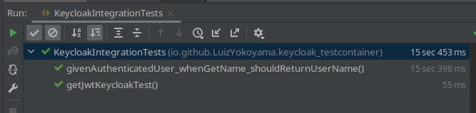

# Keycloak Testcontainer with docker-compose ***integration tests***

Esta é uma demonstração de teste de integração com testcontainer usando o Keycloak em um docker-compose.

* A configuração do docker-compose está no arquivo src/test/resources/docker-compose.yml: 

* Neste docker-compose, a porta foi indicada apenas para o caso de se rodar o arquivo manualmente, já que ao rodar no 
testcontainer é atribuída uma porta aleatória automaticamente.

* As configurações do realm do Keycloak usadas neste testcontainer estão no arquivo src/test/resources/realm-export.json
* Ao final deste arquivo foi adicionado um usuário de teste no Keycloak, que será usado para se obter o token JWT nos testes:

* Os testes de integração estão no arquivo src/test/java/io/github/LuizYokoyama/keycloak_testcontainer/KeycloakIntegrationTests.java:

### Artigos de referência:

* https://codeal.medium.com/how-to-run-docker-compose-with-testcontainers-7d1ba73afeeb
* https://www.baeldung.com/spring-boot-keycloak-integration-testing
* https://www.baeldung.com/postman-keycloak-endpoints
* https://java.testcontainers.org/modules/docker_compose/